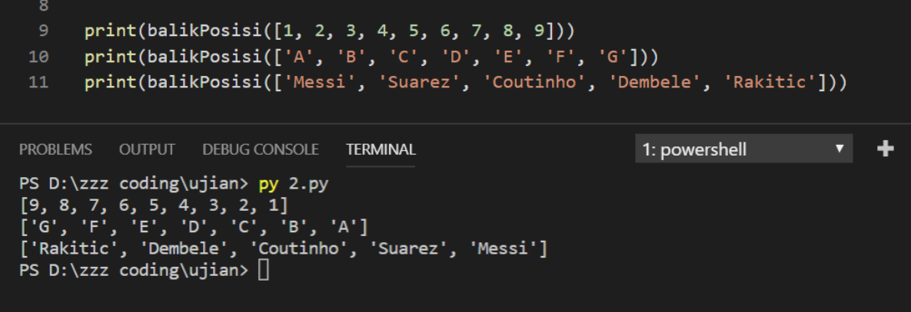

# Soal Ujian Python Data Science Fundamental


#

### **Soal 2 - Membalik Posisi Elemen List**

Buatlah __sebuah return function__ dengan __1 parameter__ yang dapat membalik urutan elemen dari suatu list. Misal terdapat suatu list: __[1,2,3,4,5]__ maka function yang Anda buat dapat membalik urutan elemen list menjadi: __[5,4,3,2,1]__. Namun Anda __dilarang keras__ untuk menggunakan cara-cara berikut:

⭐ __Cara 1.__ *menggunakan* __reverse( )__ *method pada list*
```python
a = [1, 2, 3, 4]
a.reverse()
print(a)

// hasil = [4, 3, 2, 1]
```

⭐ __Cara 2.__ *menggunakan* __list slicing__ *syntax* ( __[ : : -1]__ )
```python
b = [5, 6, 7, 8]
print(b[::-1])

// hasil = [8, 7, 6, 5]
```

⭐ __Cara 3:__ *menggunakan* __reversed( )__ *function*
```python
c = [9, 10, 11, 12]
print(list(reversed(c)))

// hasil = [12, 11, 10, 9]
```

#

- __Case Flow__: Saat dieksekusi, program akan mencetak nilai return function, yakni membalik posisi elemen dari list yang dimasukkan sebagai nilai parameter function, misal:

    ```python
    print(balikPosisi([1, 2, 3, 4, 5, 6, 7, 8, 9]))
    print(balikPosisi(['A', 'B', 'C', 'D', 'E', 'F', 'G']))
    print(balikPosisi(['Messi', 'Suarez', 'Coutinho', 'Dembele', 'Rakitic']))
    ```

- Output yang diharapkan saat file diekseskusi via terminal:
  
    ```bash
    [9, 8, 7, 6, 5, 4, 3, 2, 1]
    ['G', 'F', 'E', 'D', 'C', 'B', 'A']
    ['Rakitic', 'Dembele', 'Coutinho', 'Suarez', 'Messi']
    ```

- Contoh screenshot:

    

_**Catatan:**_ 

✅ Buatlah sebuah return function dengan 1 parameter: __balikPosisi(x)__

❌ Dilarang menggunakan __reverse( )__ list method

❌ Dilarang menggunakan __list slicing syntax [ : : -1]__

❌ Dilarang menggunakan __reversed( )__ function

✅ _Commit & push source code jawaban soal ini ke __Github__ Anda, buatlah repo dengan nama __Ujian_Balik_Elemen_List__, kemudian lampirkan __url link repo Github__ Anda via email ke lintang@purwadhika.com!_

#

### *__#HappyCoding__* :relaxed:

#### Lintang Wisesa :love_letter: _lintangwisesa@ymail.com_

[Facebook](https://www.facebook.com/lintangbagus) | 
[Twitter](https://twitter.com/Lintang_Wisesa) |
[Google+](https://plus.google.com/u/0/+LintangWisesa1) |
[Youtube](https://www.youtube.com/user/lintangbagus) | 
:octocat: [GitHub](https://github.com/LintangWisesa) |
[Hackster](https://www.hackster.io/lintangwisesa)